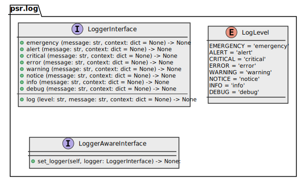

# psr.log 2

Continued logger contract based on [PSR-3 Logger interface](https://www.php-fig.org/psr/psr-3/) 
(php standard recommendation) port for python 3.5+.

---

Note that this is not a logger of its own. It is merely an interface that
describes a logger. See the specification for more details.

## Architecture overview



## Notice

Since `2.x` version `psr.log` does not supports PSR-3
and has not backward compatible code entities 
changes (see [changelog](changelog.md) for details).

If you would like to use contract definitions closest 
to PSR-3 you have to switch to [1.x version]() 

## Installation

```sh
pip install psr.log --index-url=https://source.md.land/python/
```

## [Documentation](docs/index.md)
## Usage

If you need a logger, you can use the interface like this:

```python3
import psr.log


class Foo:
    def __init__(self, logger: psr.log.LoggerInterface = None) -> None:
        self._logger = logger

    def do_something(self) -> None:
        if self._logger:
            self._logger.info('Doing work')
       
        try:
            self.do_something_else()
        except Exception as exception:
            if self._logger:
                self._logger.error('Oh no!', {'exception': exception})
            raise
        # do something useful
```

You can then pick one of the implementations of the interface to get a logger.

If you want to implement the interface, you can require this package and
implement `psr.log.LoggerInterface` in your code. Please read the
[specification text](https://github.com/php-fig/fig-standards/blob/master/accepted/PSR-3-logger-interface.md)
for details.

## [Changelog](changelog.md)

---

Take a look for [md.log](../md.log/) — the first implementation.
